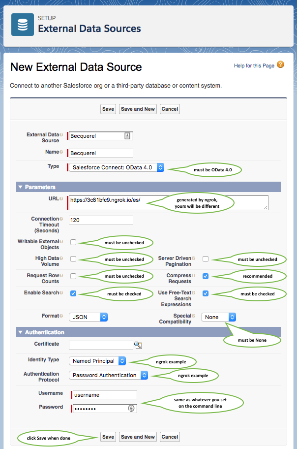
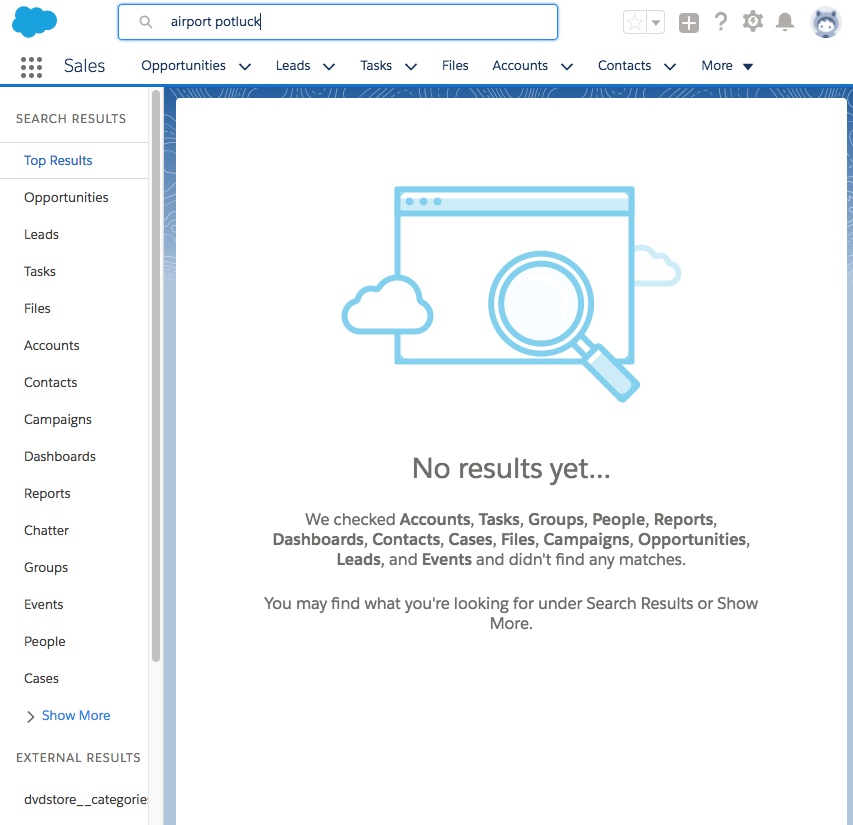

# Connecting Becquerel to Salesforce

Read this for instructions on how to connect your Becquerel instance to Salesforce.

# Table of contents

[//]: # (Generate this with gd-md-toc: https://github.com/ekalinin/github-markdown-toc.go)
[//]: # (gh-md-toc salesforce.md | grep -v gh-md-toc | tail -n +5 | sed '/^$/d')

  * [Connecting Becquerel to Salesforce](#connecting-becquerel-to-salesforce)
  * [Table of contents](#table-of-contents)
  * [Prerequisites](#prerequisites)
  * [Create an external data source for Becquerel](#create-an-external-data-source-for-becquerel)
  * [Querying objects from Becquerel](#querying-objects-from-becquerel)
  * [Searching for objects from Becquerel](#searching-for-objects-from-becquerel)

# Prerequisites

Assumes you've already deployed Becquerel with Elasticsearch, the DVD Store data, and ngrok as in the [main `README`](../../README.md).

You need to be a Salesforce system administrator to configure external objects and data sources. If you're not one, go get [a Salesforce developer instance](https://developer.salesforce.com/signup) to practice on.

You should also at least skim the docs on [Salesforce Connect external data sources](https://help.salesforce.com/articleView?id=salesforce_connect_odata.htm).

# Create an external data source for Becquerel

First, let's tell Salesforce where to find Becquerel, and what data to retrieve from it.

Click the **Setup** link in the upper right of the Salesforce UI, under the gear menu.


Click on **External Data Sources**.


Fill in the settings as shown. Remember, your ngrok URL, username, and password will be different.



On the next screen, click **Validate and Sync**. This will try to connect to Becquerel and fetch a list of tables.


This should show **Success** in the **Status** field, or you may have entered the wrong URL, Becquerel isn't running, Becquerel isn't reachable, etc. It should also show a list of tables available from Becquerel.


Check all of the **Select** boxes for Becquerel's tables, then click the **Sync** button. This will create Salesforce external objects for each table, based on the table schema.


You should now see a list of external objects from Becquerel.


Click **Edit** on one of the external object tables. We'll use `dvdstore__products` for this and further examples. You should see a list of fields and table metadata. At this point, we can search for objects in these tables in the Salesforce developer console, but we won't be able to see any of their fields in the actual Salesforce user UI, so we also need to edit the default page layout that was created on sync. Scroll down and click the **Edit** link for the page layout.


Drag some fields into the **Information** or **System Information** sections, then click the **Save** button.


At this point, we're ready to look for objects from Becquerel tables.

# Querying objects from Becquerel

First, let's try a [SOQL](https://developer.salesforce.com/docs/atlas.en-us.soql_sosl.meta/soql_sosl/sforce_api_calls_soql.htm) query through the [Salesforce developer console](https://developer.salesforce.com/page/Developer_Console).

Click the **Developer Console** link in the upper right of the Salesforce UI, under the gear menu.


The developer console will open in a new window.


Click the **File** menu and then **Open**. This will show an entity browser for various parts of Salesforce configuration. You should be able to find the Becquerel external object tables at the end of the **Objects** list (since the example tables all use lower case names, and the browser sorts things in a case-sensitive way). Note that the Becquerel table names have been suffixed with `__x` by Salesforce. Select one of them and click the **Open** button.


This should show the table schema. Note that all of the Becquerel column names have been suffixed with `__c` by Salesforce; the other ones are internal Salesforce columns and aren't stored in Becquerel. Click the **Query** button to bring up the SOQL query editor.


Let's search for a DVD by title. Enter the following SOQL query and click the **Execute** button:

```sql
SELECT Id, id__c, title__c, actor__c
FROM dvdstore_products__x
WHERE title__c = 'AIRPORT POTLUCK'
```


If you don't get any results, check for errors in Becquerel's console output, as well as ngrok's console output and web UI.

# Searching for objects from Becquerel

While SOQL is great, regular users will want to find things using a simple full-text query from the Salesforce search bar. Let's try to get that movie a different way.

Type `airport potluck` in the search bar and press **Return** or click the 🔍 icon.


By default, external object search results don't show up in the top results tab, so scroll down a bit.



The **External Results** section should have a tab for each Becquerel table. Click on the one for `dvdstore__products`, then click the **External ID** for the first result.


And there it is. Click on the **Details** tab to see the page layout we set up earlier.


